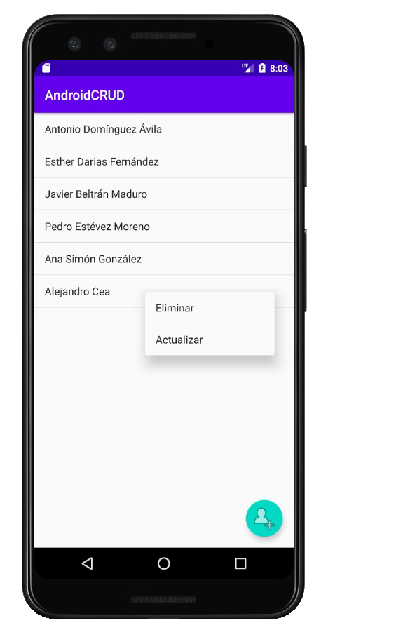

# CRUD Android

## Descripción
Proyecto Android, realización de un CRUD simple.
En él podemos encontrar un botón estilo Floating Action Button, donde podremos añadir personas al ListView a través de un RelativeLayout.
Para borrar, mantenemos pulsado encima del nombre de la persona que queremos borrar, nos aparecerá un ContextView, con la opción de eliminar, la seleccionamos, y nos saldrá una alerta, avisando de si estamos seguros de querer borrar a la persona.

## Creado con
- [Android Studio](https://developer.android.com/studio)
- [Java](https://www.java.com/es/download/)

## Capturas de pantalla

MainActivity:

Pulsando el Floating Action Button nos saldría para añadir personas:

Escribimos el nombre de la persona y pulsamos "Aceptar":

Nombre de la persona insertada con mensaje Toast:

Mantenemos pulsado en el nombre y seleccionamos "Eliminar":

Nos saldrá una alerta de si estamos seguros, le decimos que si en nuestro caso:

Persona eliminada y con un mensaje Toast:

## Autores
- Alejandro Cea
